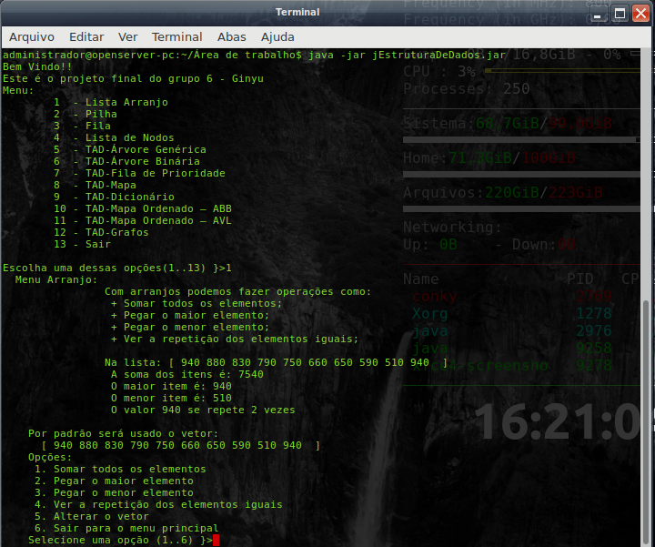

# Projeto Estrutura de dados(Avaliação Final)

 Avaliação de Estruturas de dados estrutura.

## Contribuintes

* Claudia Thifany dos Santos (RA: 1903247);
* Gilberto Ramos de Oliveira (RA: 1903991);
* Leandro Epifanio Silva Costa (RA: 1902516);
* Matheus Luz Galdino (RA: 1903502);
* Rodrigo Monastero (RA: 1904247)

## Bibliotecas

* [JUnit](https://junit.org/junit5/) - Framework para desenvolvimento de testes unitarios
* [Java](https://openjdk.java.net/) - Linguagem de programação 
